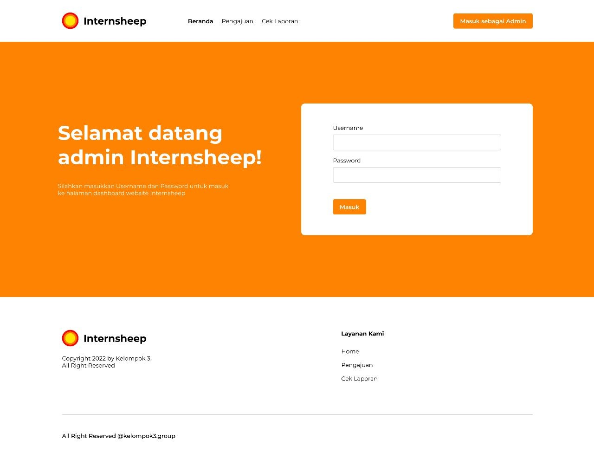
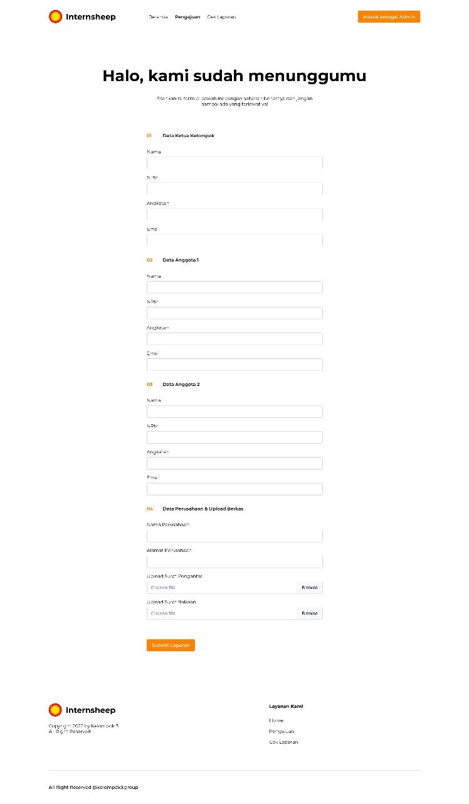
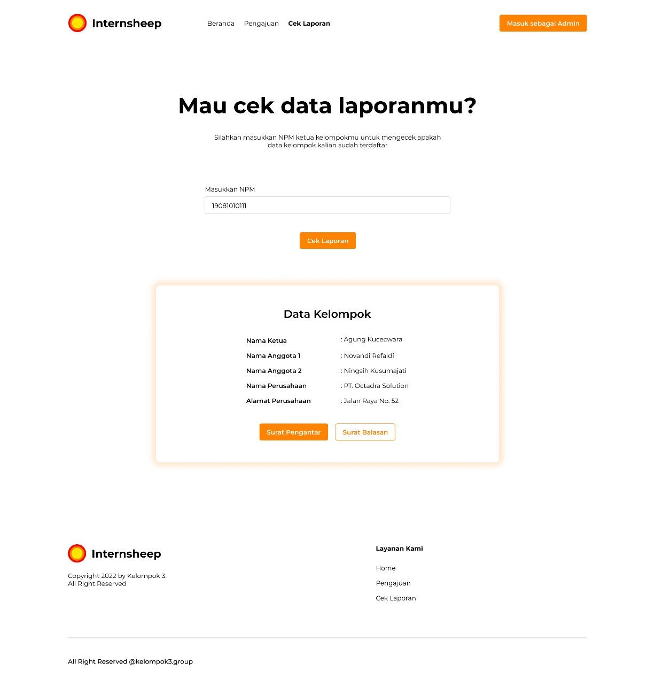
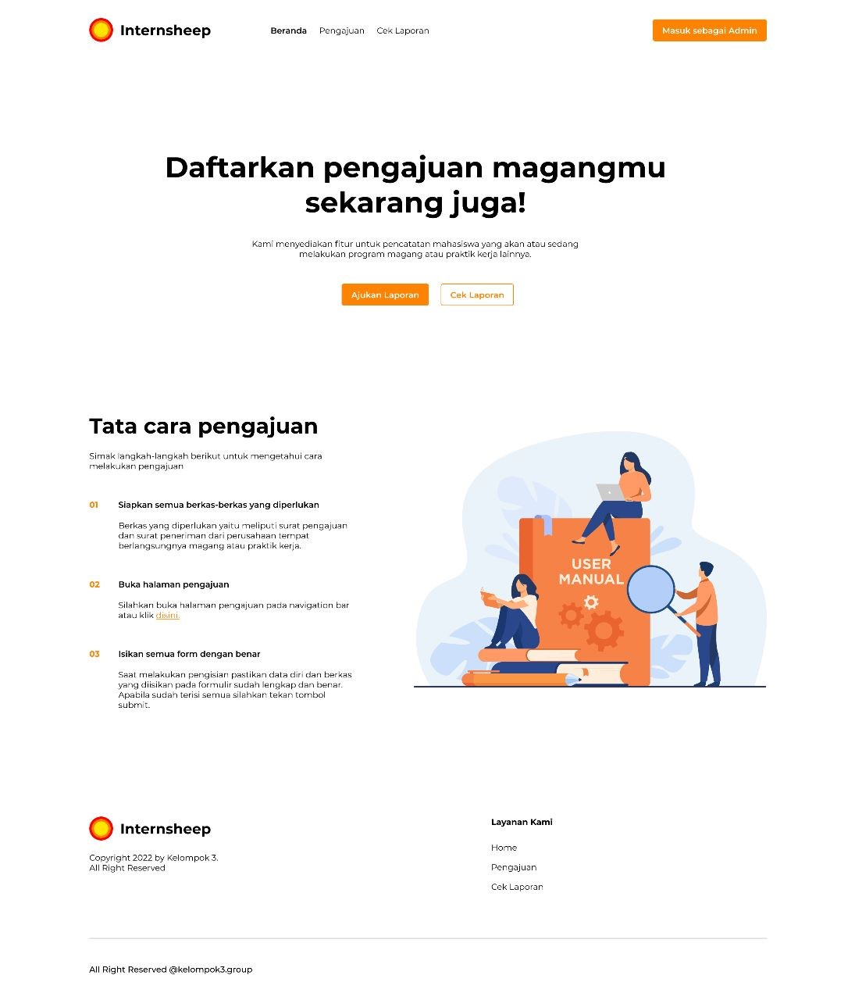
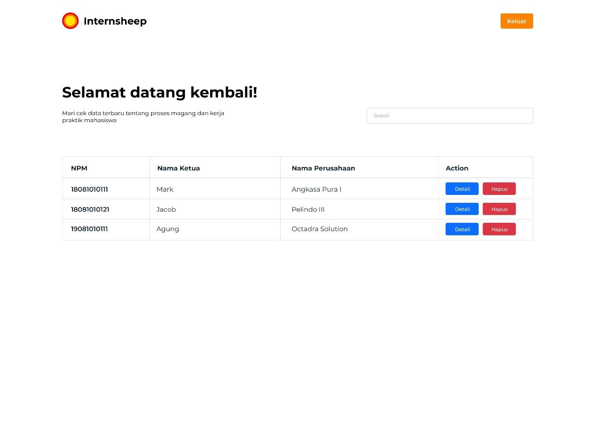
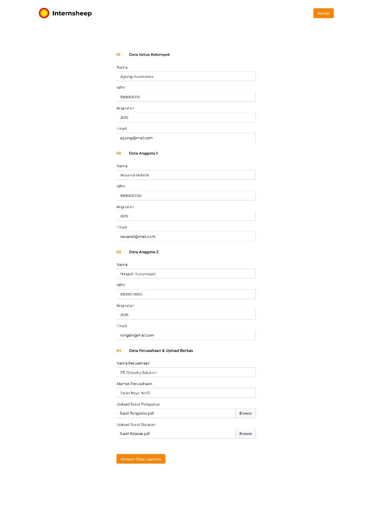

# Internsheep

Internsheep adalah website dengan fitur untuk pencatatan mahasiswa yang akan atau sedang
melakukan program magang atau praktik kerja lainnya

*******************
1.  Login admin
*******************

Halaman Login pada aplikasi Internsheep. Halaman ini berfungsi untuk memastikan bahwa yang mengakses aplikasi pada sisi admin adalah admin.

**************************
2.	Halaman Daftar Pelaporan Data Magang
**************************

Halaman Pengajuan pada aplkasi Internsheep. Halaman ini berfungsi untuk menginputkan data-data mahasiswa tiap individu atau kelompok serta berkas persyaratan pengajuan magang yang dibutuhkan.

*******************
3.	Cek Pelaporan
*******************

Halaman Cek Pelaporan pada aplikasi Internsheep. Halaman ini bertujuan untuk mengetahui dan mencari ajuan magang yang telah diinputkan oleh mahasiswa tiap individu atau kelompok.

************
4.	Landing Page
************

Halaman landing page atau halaman utama pada aplikasi Internsheep. Halaman ini bertujuan untuk memberikan infografis untuk melakukan pengajuan magang.

# Admin Environtment

*******
1.  Tabel pendaftar
*******

Halaman Pendaftaran Magang pada aplikasi Internsheep. Halaman ini berfungsi untuk melihat data pendaftar.

*********
2.  Edit Data
*********
Halaman Edit Data pada aplikasi Internsheep. Halaman berfungsi untuk melakukan perubahan data yang telah diajukan.

***************
3.  Delete Data
***************
Halaman Delete Data pada aplikasi Internsheep. Halaman ini berfungsi untuk menghapus data ajuan sesuai dengan kondisi yang diajukan.

***************
4.  Logout
***************
Halaman Logout pada aplikasi Internsheep. Halaman ini berfungsi untuk menghilangkan session atau keluar sebagai admin.

